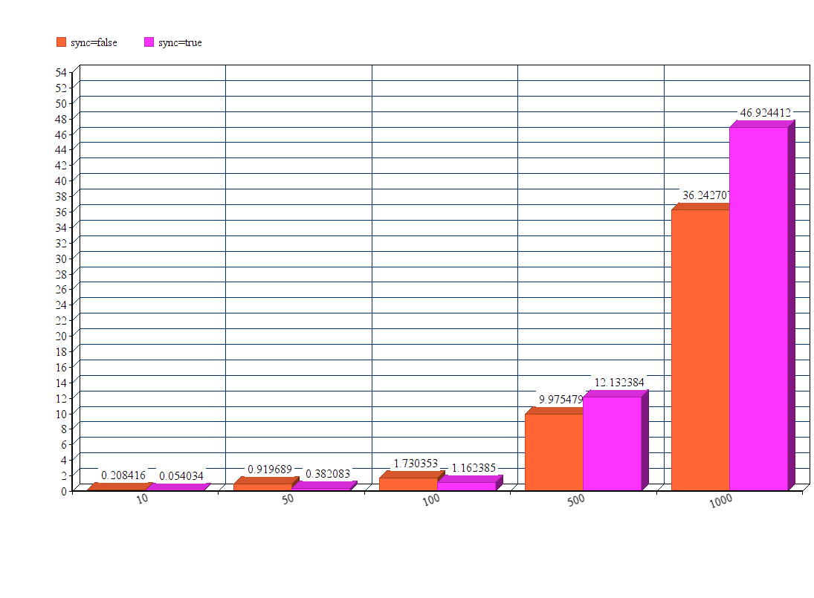

# TehnologiiJava_Master

## Laborator 1: Finalizat complet (Foldere: Laborator1 si Laborator1_ExternalPython)
Servletul creat pentru rezolvarea primului punct este HelloServlet.
Acesta primeste datele din formul din index.jsp pe care le proceseaza conform enuntului.
Observam ca metoda solveMockWhenIsFalse(request, response) valideaza datele primite din form inainte de a executa requestul efectiv.

Pentru punctul al doilea, scriptul in Python care apeleaza servletul nostru se afla in folderul Laborator1_ExternalPython.

Pentru al treile punct, cateva rezultate sunt:
* sync=false
- 10: 0.20841598510742188 seconds
- 50: 0.9196887016296387 seconds
- 100: 1.7303531169891357 seconds
- 500: 9.975478649139404 seconds
- 1000: 36.24270725250244 seconds

* sync=true
- 10: 0.054033517837524414 seconds
- 50: 0.3820829391479492 seconds
- 100: 1.1623854637145996 seconds
- 500: 12.132383584976196 seconds
- 1000: 46.92441248893738 seconds

O observatie pe care o putem face pe datele de mai sus (reprezentate in graficul de mai jos), ar fi ca pentru numar mic de threaduri concurente (un volum mai mic de requesturi venite simultan), este mai buna o abordare sincrona, in timp ce pentru un numar mai mare de threaduri concurente (un volum mai mare de requesturi venite simultan), o abordare asincrona va fi castigatoare.

